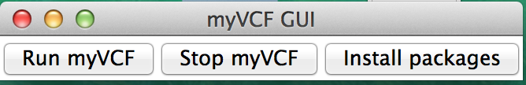

# myVCF: web-based platform for NGS data analysis management #

Welcome to myVCF project page.

### What is this repository for? ###

myVCF is a user-friendly platform that helps end-users, without programming skills, to analyze and visualize mutations data to guide strategies for further downstream analysis.

### Do you want to try with your own data? ###

Download the myVCF package or clone the Github project - http://github.com/apietrelli/myVCF/

### How do I get set up? ###

#### Quick start-up with GUI

* Open myVCF directory

* Double-Click to open myVCF GUI

  - **myVCF_GUI.py** for Windows
  - **myVCF_launcher** for MAC and Linux

* Click on **"Run myVCF"** from the GUI menu



* It will open a browser with **myVCF homepage**!

#### Quick start-up on Terminal

``` shell
# Clone myVCF GitHub project
git clone https://github.com/apietrelli/myVCF.git

# Enter into myVCF directory
cd myVCF

# Run the server
python manage.py runserver

> Performing system checks...
> System check identified no issues (0 silenced).
> December 05, 2016 - 17:30:09
> Django version 1.8.4, using settings 'myVCF_django.settings'
> Starting development server at http://127.0.0.1:8000/
> Quit the server with CONTROL-C.

Open the internet browser and go to http://localhost:8000/
```


### Where I can find the documentation? ###

You will find further instructions for installation and setup at http://myvcf.readthedocs.io/

### Who do I talk to? ###

* Alessandro Pietrelli pietrelli@ingm.org
