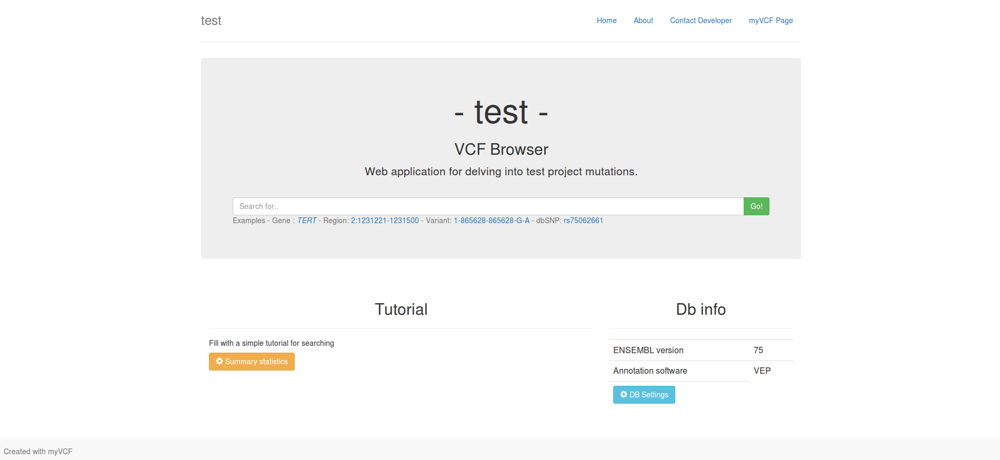
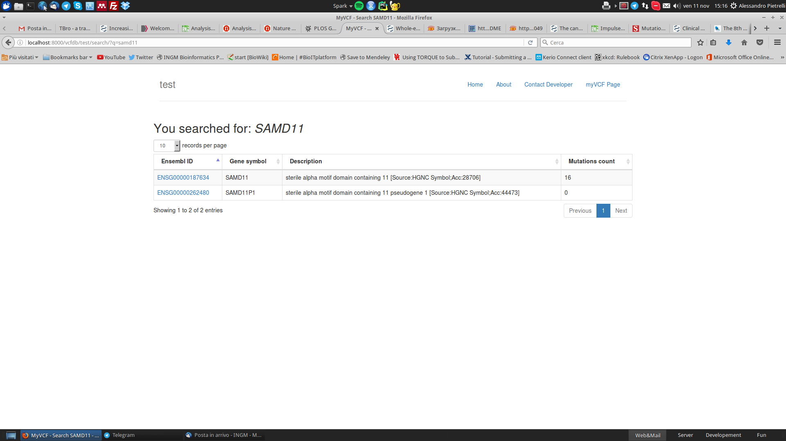
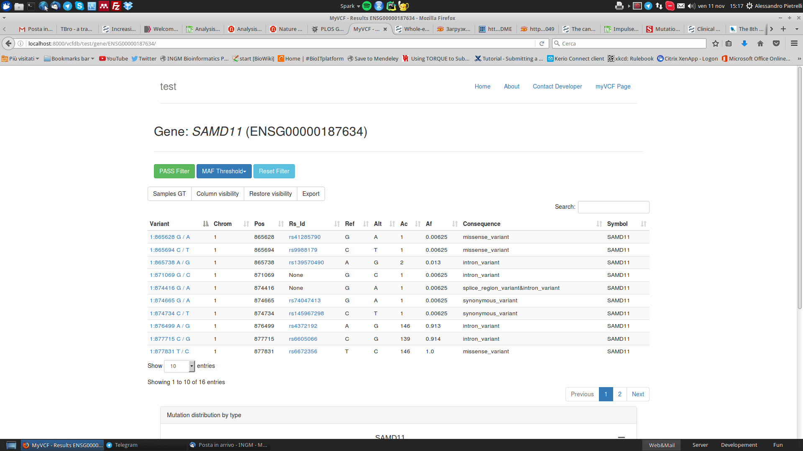
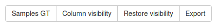
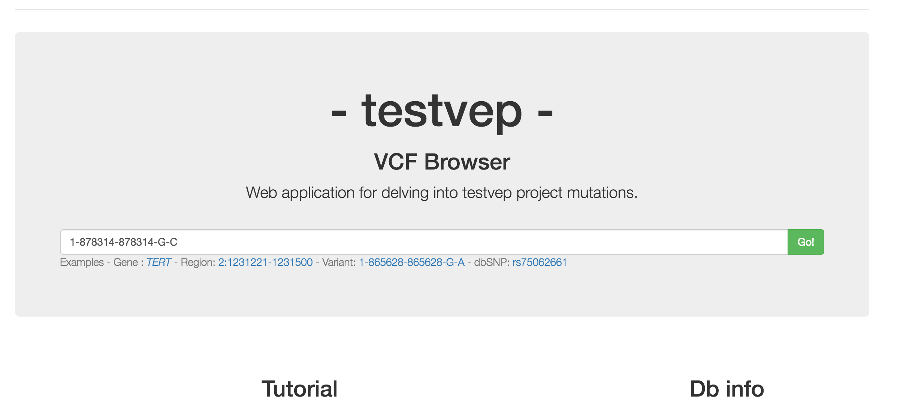
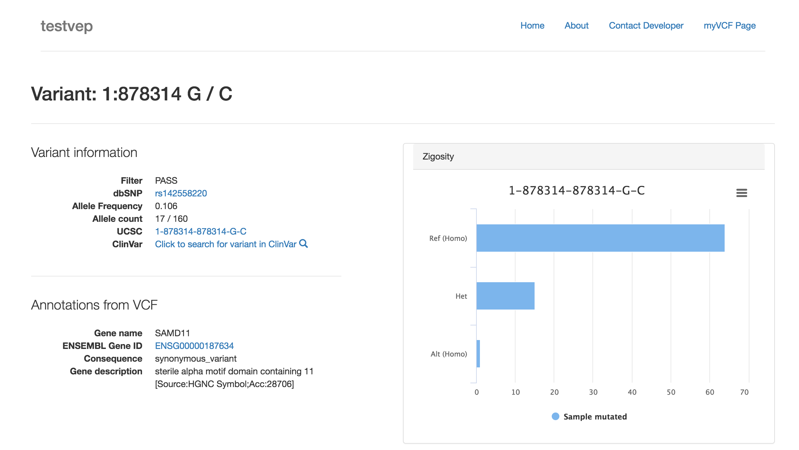
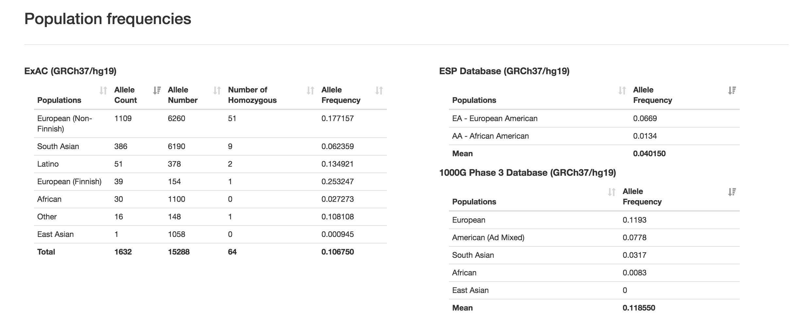

myVCF features
==============

myVCF is designed as a tool for browsing and visualizing mutational data coming from NGS technology, including Whole-Exome and -Genome sequencing as well as target resequencing.

Several features have been implemented to help the end user in the navigation and the exploration of his project. In the next paragraphs you will find the description of principal features available in myVCF.

How to query a project database?
--------------------------------

The search engine in myVCF is very versatile.
Once you are in a project homepage, you can query the database by searching for:

1. Gene name (Official Gene Symbol)
2. Genomic region (1:20000-200100)
3. dbSNP ID (rs324239)
4. Variant (1-456783-456783-A-T)

Gene/Region view
^^^^^^^^^^^^^^^^

Basic gene/region search will generate a **Gene page** composed by:

- **Table** containing the mutation found in the gene/region
- **Mutation plot** showing the distribution of the mutations grouped by their functional consequence.

Here we described a simple gene search example

Example for **SAMD11** gene search:
~~~~~~~~~~~~~~~~~~~~~~~~~~~~~~~~~~~

- Launch myVCF application (see how to :ref:`launch here <launch_app>`)

.. figure:: img/myVCF_homepage.png
   :scale: 50 %
   :alt: Homepage myVCF
   :align: center

- Click on the project name you want to explore

- Fill the text box with :code:`SAMD11` region you want and click **GO!**

We searched for :code:`SAMD11` gene. The system will put wildcards (:code:`*`) at the edges of the gene name automatically and search for :code:`*SAMD11*`.

- To display the mutation list for :code:`SAMD11 - ENSG00000187634` just click on the **ENSEMBL Gene ID** link and you will be directed to the **SAMD11 gene page**

You can filter the mutations by using the *Filter buttons* |filter_buttons|

- **PASS Filter** - Only PASS mutations will be showed. This filter acts on :code:`FILTER` field in VCF file
- **MAF Threshold** - Only mutations with Allele Frequency (AF) lower than MAF selected will be selected. This filter acts on :code:`AF` field in VCF file.
- **Reset Filters** - Reset all filters. All mutation will be displayed

You can also modify the visualization aspect by using the *Display buttons* |display_buttons|

- **Samples GT** - All the sample genotypes (stored from VCF file) will be available and showed in the table
- **Column visibility** - Toggle On/Off the columns by selecting them from a dropdown menu
- **Restore visibility** - Restore the default column visualization
- **Export** - Save the table in different format including :code:`XLS`, :code:`PDF` and :code:`CSV`

  .. hint:: The table export will recapitulate the browser visualization. If the Sample genotype columns are showed in the table, there will be exported in the file.

.. Note:: This visualization and all the entire features described in this paragraph are available for **Gene** (as in the example), **Region** and **dbSNP ID** search

Variant view
^^^^^^^^^^^^

Variant view directly connected the single variant with the additional information contained in the VCF file uploaded and stored in myVCF databese.

The variant page links additional information about the frequency of the searched variation interrogatong the principal available population frequencies database:

- **ExAC**
- **ESP**
- **1000Genomes**

Data from those database will be automatically displayed in the page.

Example for **variant** search:
~~~~~~~~~~~~~~~~~~~~~~~~~~~~~~~

- You can search directely for single variant by using the format:

  **CHR-Position-Position-Ref-Alt**

  from the project home page.

  In this example we are going to search for **1-878314-878314-G-C** variant.

- If the variant exists in the VCF, the **variant page** retireve information from VCF regarding:

  - **Variant quality**
  - **Variant annotation**
  - **Zigosity distribution** across samples

- In the bottom part of the page, will be available the frequency distribution of the same variant in the major public databases

.. important::
  Since all the linked public database are mapped on **GRCh37/hg19** human assembly, if you load and query variation from GRCh38 assembly the frequency showed won't be correct!

.. hint::
  Every variation in the **gene table view** (described before) is a link to its variant page.

.. Note:: Internet connection is needed to retrieve the frequency information from public databases.

VCF metrics summary
-------------------

Click on ...
Cache will speed-up the process once is loaded for the first time.

- metric 1
- metric 2
- metric N

Change default columns view
---------------------------
