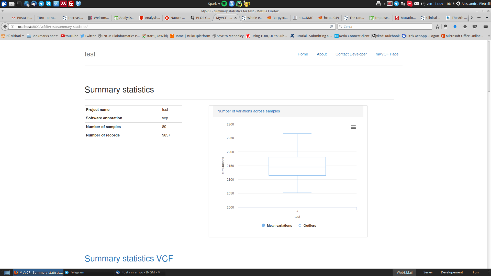
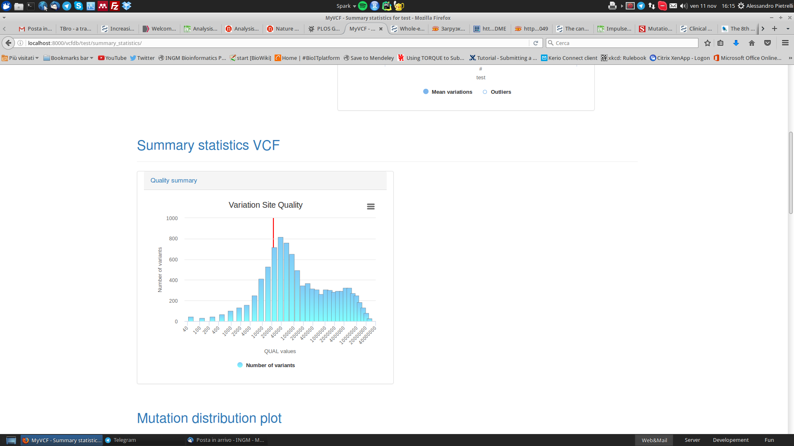
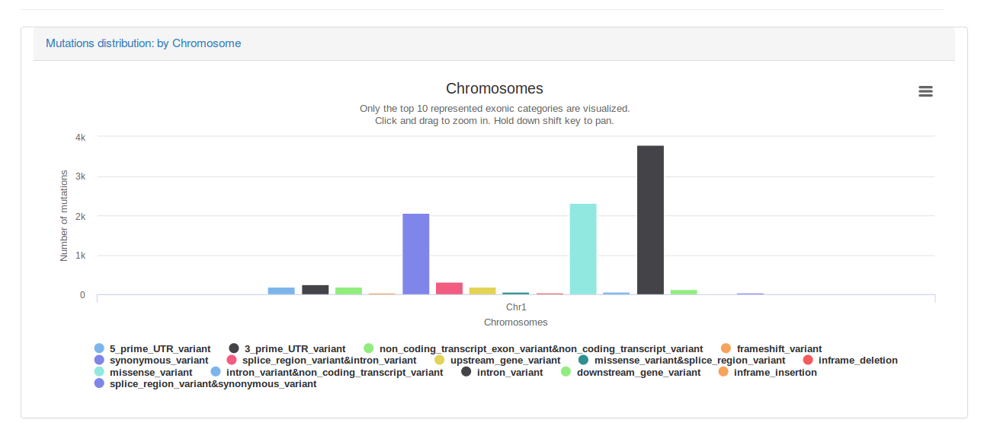
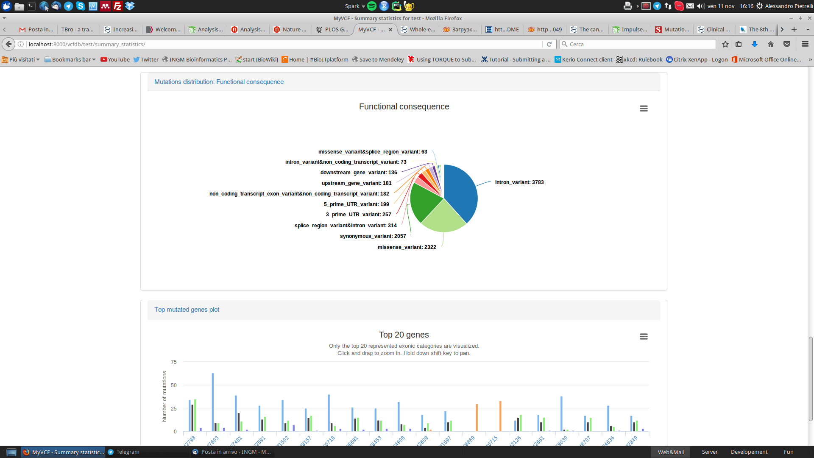
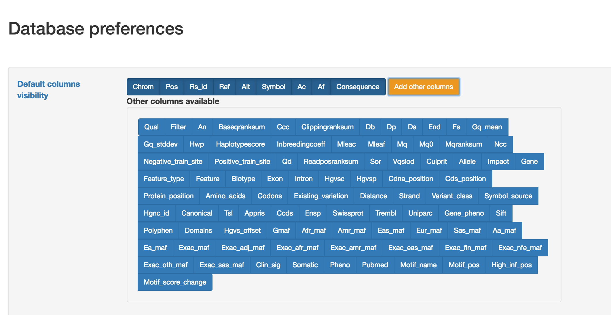
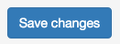

myVCF features
==============

myVCF is designed as a tool for browsing and visualizing mutational data coming from NGS technologies, including Whole-Exome and -Genome sequencing as well as target resequencing.

Several features have been implemented to help the end-user in the navigation and the exploration of his project. In the next paragraphs you will find the description of principal features available in myVCF.

How to query a project database?
--------------------------------

The search engine in myVCF is very versatile.
Once you are in a project homepage, you can query the database by searching for:

1. Gene name (Official Gene Symbol)
2. Genomic region (1:20000-200100)
3. dbSNP ID (rs324239)
4. Variant (1-456783-456783-A-T)

Gene/Region view
^^^^^^^^^^^^^^^^

Basic gene/region search will generate a **Gene page** composed by:

- **Table** containing the mutations found in the gene/region
- **Mutation plot** showing the distribution of the mutations grouped by their functional consequence.

Here we described a simple gene search example

Example for **SAMD11** gene search:
~~~~~~~~~~~~~~~~~~~~~~~~~~~~~~~~~~~

- Launch myVCF application (see how to :ref:`launch here <launch_app>`)

.. figure:: img/myVCF_homepage.png
   :scale: 50 %
   :alt: Homepage myVCF
   :align: center

- Click on the project name you want to explore

.. figure:: img/myVCF_project_homepage.png
   :scale: 50 %
   :alt: Homepage myVCF
   :align: center

- Fill the text box with :code:`SAMD11` and click **GO!**

.. figure:: img/myVCF_search_SAMD11.png
   :scale: 50 %
   :alt: search samd11
   :align: center

We searched for :code:`SAMD11` gene. The system will output all genes containing the name you searched for. So in this case, togheter with :code:`SAMD11`, the pseudogene :code:`SAMD11P1` is also reported.

- To display the mutation list for :code:`SAMD11 - ENSG00000187634` just click on the **ENSEMBL Gene ID** link and you will be directed to the **SAMD11 gene page**

.. figure:: img/myVCF_results_SAMD11_part1.png
   :scale: 50 %
   :alt: search samd11
   :align: center

You can filter the mutations by using the *Filter buttons* |filter_buttons|

.. |filter_buttons| image:: img/myVCF_results_filter_buttons.png

- **PASS Filter** - Only PASS mutations will be showed. This filter acts on the :code:`FILTER` field in the VCF file
- **MAF Threshold** - Only mutations with an Allele Frequency (AF) lower than the MAF threshold you have selected will be reported. This filter acts on the :code:`AF` field in the VCF file.
- **Reset Filters** - Reset all filters. All mutations will be displayed.

You can also modify the visualization aspect by using the following *Display buttons* |display_buttons|

.. |display_buttons| image:: img/myVCF_results_display_buttons.png

- **Samples GT** - All the genotypes of the semples (stored in the VCF file) will be showed in the table
- **Column visibility** - Toggle On/Off the columns by selecting them from a dropdown menu
- **Restore visibility** - Restore the default column visualization
- **Export** - Save the table in different formats including :code:`XLS`, :code:`PDF` and :code:`CSV`

  .. hint:: The function to export the table will recapitulate the browser visualization. If the Sample genotype columns are showed in the table, they will be exported in the file.

.. Note:: This visualization (Gene view) and all the entire features described in this paragraph are available to search for **Gene** (as in the example), **Region** and **dbSNP ID**

Variant view
^^^^^^^^^^^^

Variant view directly connectes the single variant with the additional information contained in the VCF file uploaded and stored in myVCF database.

The variant page links additional information about the allele frequency of the searched variation by interrogating all the principal population frequency database:

- **ExAC**
- **ESP**
- **1000Genomes**

Data from those database will be automatically displayed in the page.

Example for **variant** search:
~~~~~~~~~~~~~~~~~~~~~~~~~~~~~~~

- You can search directely for single variant by using the format:

  **CHR-Position-Position-Ref-Alt**

  from the project home page.

  In this example we are going to search for the **1-878314-878314-G-C** variant.

.. figure:: img/myVCF_search_variant.png
     :scale: 50 %
     :alt: search variant
     :align: center

- If the variant exists in the VCF file, the **variant page** will retireve information from the VCF regarding:

  - **Variant quality**
  - **Variant annotation**
  - **Zigosity distribution** across samples

.. figure:: img/myVCF_variant_page_1.png
     :scale: 50 %
     :alt: search variant
     :align: center

- In the bottom part of the **variant page**, the frequency of the variant will be available the distribution of the same variant in the major public databases

.. figure:: img/myVCF_variant_page_2.png
     :scale: 50 %
     :alt: search variant
     :align: center

.. important::
  Since all the linked public database are mapped on **GRCh37/hg19** human assembly, if you load and query variation from GRCh38 assembly the frequency showed won't be correct!

.. hint::
  Every variation in the **gene table view** (described before) is a link to its variant page.

.. Note:: Internet connection is needed to retrieve the frequency information from public databases.

VCF metrics summary
-------------------

myVCF can also generate a global VCF summary report considering several metrics and information.

You can generate this report by clicking on the *Summary button* |summary_button|

.. hint:: First statistics loading could takes some time (minutes), especially for exome/genome projects. All the next loadings will be very fast thanks to the system saving cache that speed-up the process. Cache memory will be clear once the application is closed.

The VCF quality report page consists of several statistics and plots all-in-one page. You can export separately each plot as single image.

Here, some example of the statistics generated:

- Number of variants and mutation distribution across samples

- Variant quality distribution

- Variants distribution across chromosomes stratified by functional consequence

- Variant functional consequence distribution as pie chart

Change default columns view
---------------------------

By default myVCF visualize a set of columns in the gene/region view composed by the principal annotation given by the VCF file.

You can change the default view by accessing to the *DB settings page* |dbcolview_button|

You will be redirected to the preferences page and you can select which columns will be displayed in the Gene/Region table.

To save the column view modified by the user, click on *Save changes* |save_changes|

