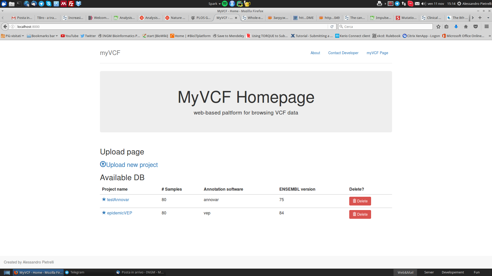

.. _install_label:

How to install myVCF
====================

Download myVCF
--------------

You can download **myVCF** package from:

- **Compressed package**

1. Go to `myVCF homepage <https://apietrelli.github.io/myVCF/>`_
2. Click on one of the buttons |download_buttons|

.. |download_buttons| image:: img/myVCF_download_buttons.png

3. Extract the compressed file in your working directory
4. At the end of the process you will have a directory named :code:`myVCF/` containing the desktop application

- **GitHub**

If you have GitHub installed on your computer, you can clone the project directly on your working directory

1. Open the terminal and type:

.. note::
  For MAC users, you can find the terminal app by searching through Spotlight and type :code:`terminal` and click on the application

.. code-block:: shell

  $> cd path/to/working/dir
  $> git clone https://github.com/apietrelli/myVCF.git

The command will create a directory named :code:`myVCF/` containing the desktop application

.. note::
    To download :code:`git` tool for Unix/MAC operating system

    .. code:: shell

      # Ubuntu/Debian Unix OS
      $> sudo apt-get install git
      # MAC
      $> brew install git
    for Windows users, you can download the git software from the `Git homepage <https://git-scm.com/download/win>`_ and use the same command as for Unix/MAC user by using `GitBASH <https://git-for-windows.github.io/>`_

.. warning:: Remember the path to myVCF application because will be useful in requirements installation and :ref:`VCF file loading <load_vcf>`

Install requirements
--------------------

The application is developed using `Python/Django <https://www.djangoproject.com/>`_ framework and use `sqlite <https://sqlite.org/>`_ as database platform.
Please verify the installation of :code:`python2.7` and :code:`sqlite` on your computer.

Python 2.7
^^^^^^^^^^

All the myVCF tool is based on **Python 2.7** language. Please verify the installation of python.

If you are not sure or you need to install it, please follow the notes below about the installation depending on your operating system.

**Unix (Ubuntu/Debian system)**

Using terminal, install :code:`python2.7` using :code:`apt-get`

.. code-block:: shell

  $> sudo apt-get install python2.7

**MAC**

Open the terminal and install :code:`python2.7` with :code:`brew`

.. Note::
  You can find the shell terminal in MAC OS by typing :code:`terminal` in Spotlight textbox and click on the application.

.. code-block:: shell

  # Terminal application
  $> brew install python2.7

You can test the installation in the terminal

.. code-block:: shell

  $> python
  Python 2.7.5 (default, Mar  9 2014, 22:15:05)
  [GCC 4.2.1 Compatible Apple LLVM 5.0 (clang-500.0.68)] on darwin
  Type "help", "copyright", "credits" or "license" for more information.
  >>>
  >>>quit()

.. _install_python_win:

**Windows**

You can download the :code:`python2.7` package from `Python project site <https://www.python.org/downloads/>`_

Follow the installation process.
By default Python2.7 will be installed in :code:`C:\Python27`. Please **DO NOT** modify the Python path and leave the default installation destination directory.

.. warning:: Please download the **Python2.7** package **NOT** Python3.x

sqlite
^^^^^^

The storage of VCF data has been implemented by using :code:`sqlite` as backend database. This cross-platform solution allows the end-user to workaround some complex configuration setups which are mandatory with other database system.

Please following this instructions to install :code:`sqlite` depending on your operating system

**Unix (Ubuntu/Debian system)/MAC**

1. Open the :code:`terminal`
2. Install :code:`sqlite3` package

.. code-block:: shell

  # Ubuntu/Debian Unix OS
  $> sudo apt-get install sqlite3
  # MAC OS
  $> brew install sqlite3

3. Launch :code:`sqlite3` from shell

.. code-block:: shell

  $> sqlite3
  SQLite version 3.7.13 2012-07-17 17:46:21
  Enter ".help" for instructions
  Enter SQL statements terminated with a ";"
  sqlite>
  # Quit from the sqlite3 shell
  sqlite> .q

**Windows**

1. Go to sqlite web site https://sqlite.org/download.html and download precompiled binaries from Windows section.

  * **sqlite-dll-win32-x86-\*.zip**

  or

  * **sqlite-dll-win64-x64-\*.zip**

.. warning::

  Check your Windows version installed (32 or 64 bit) to correctely download the right :code:`sqlite3` package from the web site

  To check your system click on:

  **Start** > **Control panel** > **System**

  and check the version.
2. Unpack the :code:`.zip` file and follow the installation

Python library dependecies
^^^^^^^^^^^^^^^^^^^^^^^^^^

Now that all the major components have been installed, lets proceed with the last step of installation regarding the Python library dependencies.

If the :code:`python2.7` installation doesn't fails, you should have also installed :code:`pip` which is the Python command for its library installation.

Now we are going to install all the dependencies in one-shot using :code:`pip`

**Unix (Ubuntu/Debian system)/MAC**

1. Open the terminal
2. Go to :code:`myVCF/` directory
3. Execute this command:

.. code-block:: shell

  pip install -r requirements.txt

Verify the installation by typing::

  python manage.py shell

If you see something like..

.. code-block:: python

  Python 2.7.5 (default, Mar  9 2014, 22:15:05)
  Type "copyright", "credits" or "license" for more information.
  >>>

..everithing went fine!
Now exit from the python shell.

.. code-block:: python

  >>> quit

.. _cmd_label:

**Windows**

1. Open the MS-DOS prompt (:code:`cmd.exe`)

.. Note::
  To open CMD shell in Windows click on

  **Start** > type on the search box "**cmd**" > click on **cmd.exe**

2. Go to :code:`myVCF/` directory
3. Execute this command:

.. code-block:: dos

  # MS-DOS Prompt
  $> C:\Python27\python.exe pip -m install -r requirements.txt

.. warning::
  If you followed the :ref:`Python 2.7 Windows installation chapter <install_python_win>`, you shold have the all Python command in :code:`C:/Python27/`

.. _launch_app:

Launch the application
----------------------

Finally, you're ready to start the webserver::

    # UNIX on terminal
    $> cd path/to/myVCF/
    $> python manage.py runserver

    # Windows on MS-DOS cmd
    $> cd C:\path\to\myVCF\
    $> C:\Python27\python.exe manage.py runserver

Visit http://127.0.0.1:8000/ in your browser to see how it looks.

