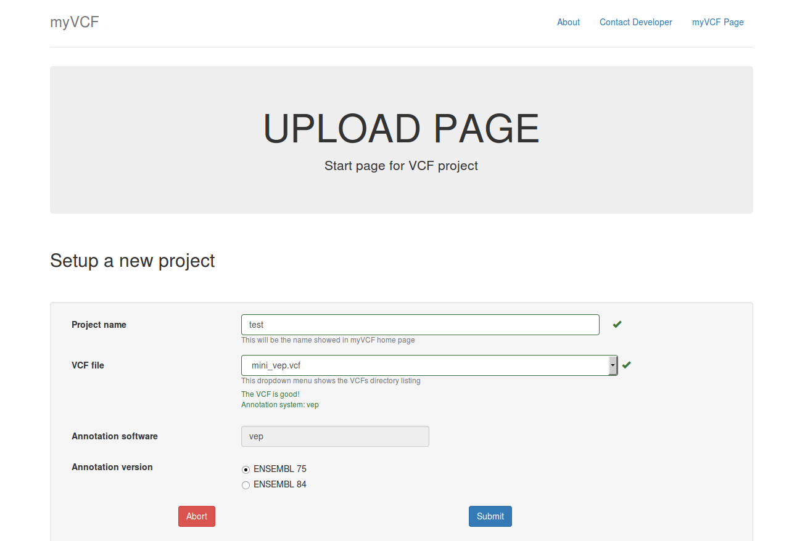

.. _setup_label:

Setup the application
=====================

Now you are ready to load all your VCFs and start to analyze your data with myVCF

myVCF manage **annotated VCF** files that contain some mandatory fields in order to load and visualize them correctely.

To verify if your :code:`.vcf` file is compatible with myVCF, please read the following section

VCF fields and requirements
---------------------------

Basically myVCF read VCF files coming from **Annovar** of **VEP** systems. Those softwares are the most common tool used for VCF annotation after the SNP call step.

.. Note::
  If you are not sure if your VCF file respect the mandatory field and requirements, try to load it by following the :ref:`Load new data section <load_vcf>`

Let's definde which are the mandatory fields for myVCF tool

- The VCF file **must** contain at least 1 sample genotyped (IMG EXAMPLE)

- For **Annovar** annotated VCF the mandatory field within the file would be:

  1. Gene_ensgene
  2. ExonicFunc_ensgene

- For **VEP** annotated VCF the mandatory field within the file would be:

  1. CSQ

  This field is added by default during VEP annotation

.. Note::
  To verify the necessary fields for the annotation part, you should see in the HEADER part of the VCF those lines:
  (Example images)

How to annotate your VCF
------------------------

If you don't have the genomic/transcript annotation for your VCF file, or the VCF is not suitable for myVCF please consider to annotate it using the following instructions.

------------------------
How to install the tools
------------------------

Annovar
^^^^^^^

**Unix (Ubuntu/Debian system)/MAC**

**Windows**

VEP
^^^

Main resource
http://www.ensembl.org/info/docs/tools/vep/index.html

Main tutorial
http://www.ensembl.org/info/docs/tools/vep/script/vep_tutorial.html

**Unix (Ubuntu/Debian system)/MAC**

Following the example in this page (http://www.ensembl.org/info/docs/tools/vep/script/index.html)

1. Download the :code:`ensembl-tools-release-*.zip` file
2. Unpack the archive
3. Install it

**Windows**

Please follow this `instuctions <http://www.ensembl.org/info/docs/tools/vep/script/vep_download.html#windows>`_ to install and configure VEP for windows system.

.. Note:: The easiest way is the **Cygwin** installation procedure.

------------------------------
Launch the code for annotation
------------------------------

Here it is reported the *minimum code* to run for a correct annotation compatible with myVCF. The tutorial contains both the *Annovar* and *VEP* annotation procedure.

For **Windows users** please launch the commands using **Cygwin** downloaded in previous section or **CMD shell** (:ref:`find CMD <cmd_label>`)

Annovar
^^^^^^^

1. Download the ENSEMBL transcript reference database required for myVCF compatibility

.. code-block:: shell

  # Download the ensembl DB (example: hg19)
  # buildver = hg19/hg38 depending on what reference assembly you used during the read mapping
  table_annovar.pl -downdb -webfrom annovar -buildver hg19 ensGene

  ## Optional but useful annotation
  # dbSNP147
  table_annovar.pl -downdb -webfrom annovar -buildver hg19 avsnp147
  # dbnsfp30a - non-synonimous variants annotation compendium (it takes lot for download)
  #http://annovar.openbioinformatics.org/en/latest/user-guide/filter/#ljb42-dbnsfp-non-synonymous-variants-annotation
  table_annovar.pl -downdb -webfrom annovar -buildver hg19 dbnsfp30a

.. Note:: To see all the database availabe for annovar, pleas click on `this link <http://annovar.openbioinformatics.org/en/latest/user-guide/download/>`_

2. Launch the annotation process following `Annovar tutorial <http://annovar.openbioinformatics.org/en/latest/user-guide/startup/#table_annovarpl>`_.

.. code-block:: shell

  # Launch the annotation
  table_annovar.pl example/ex2.vcf humandb/ -buildver hg19 -out myanno -remove -protocol ensGene,avsnp142,dbnsfp30a -operation g,f,f -nastring . -vcfinput

.. Note:: To download additional databases to enrich the annotation for your mutations, please see `this link <http://annovar.openbioinformatics.org/en/latest/user-guide/download/#additional-databases>`_ and modify the *Lunch the application* command line by adding the name of the database in :code:`-protocol` and an :code:`f` in :code:`-operation` for every database

VEP
^^^

Simplier than Annovar, once downloaded the tool and the human assembly containing the annotations, launch this command to annotate your vcf

.. code-block:: shell

  perl variant_effect_predictor.pl -i example.vcf --cache --force_overwrite --vcf -o example_VEP.vcf

At the end of the process you will have file named :code:`example_VEP.vcf` with all the information suitable for myVCF

.. _load_vcf:

Load new data
-------------

1. Copy/move the VCF files you want to load into the system in :code:`/path/to/myVCF/data/VCFs`
2. Launch the application (See how to :ref:`launch the app <launch_app>`) and load http://127.0.0.1:8000/ in your browser
3. Click on the **Upload new project** link in the myVCF homepage
4. Give a name to the project and select the VCF to load

   New Project upload page example. :code:`mini_VEP.vcf` is the mutation file to upload into :code:`testVEP` project. 

.. Note:: If you don't find your VCF in the dropdown menu, please verify that you have copied the file into :code:`myVCF/data/VCFs` directory and restart the application

5. Click on submit button (IMG)

.. Note:: The storing process of very large VCF files (above 50 MB) will takes long time.
Don't Panic and do **NOT refresh** the page until the **Upload completed** page will be showed.

Notes
-----
